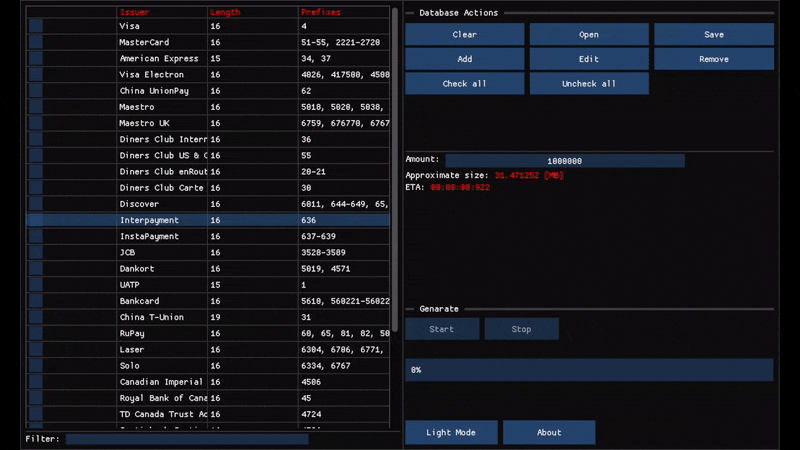
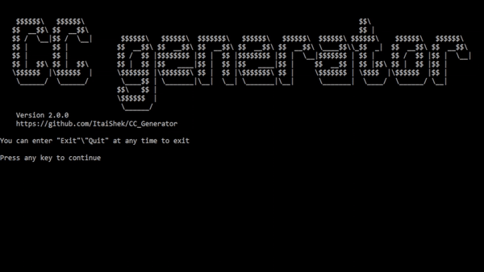

<!-- Badges -->

# Description

Generate a bunch of random credit card numbers quick and easy.

## Installation

### Windows:
[x64](https://github.com/ItaiShek/CC_Generator/releases/latest/download/win_x64.zip), [x86](https://github.com/ItaiShek/CC_Generator/releases/latest/download/win_x86.zip)

### Linux:
[x64](https://github.com/ItaiShek/CC_Generator/releases/latest/download/linux_x64.zip)

### Compilation:
* For windows: open the solution file with visual studio and compile.
* For linux: open the terminal in the repo's directory and run `make`.

#### Note
The GUI and console files are loaded dynamically, so the terminal stays open for both of them. If you want a fully GUI/Console version you'll need to change the main file to load one of them and make a standalone executable.

## Usage
* GUI: run the application.
* Console: `CC_Generator --console`

Just follow the steps...

## Disclaimer
Every credit card that is generated with CC_Generator is **random and fake** and do not hold any value.

Credit card numbers that are generated with CC_Generator follows luhn algorithm for validating identification numbers 

These credit cards are **not** to be used for harming or deceiving people.

These credit cards are for educational and data testing purposes only.

I will not take **any responsibility** for damages that arise of misusing CC_Generator.