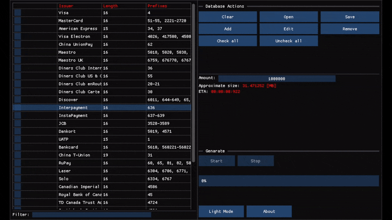

<!-- Badges -->

# Description

Generate a bunch of random credit card numbers quickly and easily.

## Installation

### Direct download:
[Windows](https://github.com/ItaiShek/CC_Generator/releases/latest/download/CC_Generator_win.zip)

[Linux](https://github.com/ItaiShek/CC_Generator/releases/latest/download/CC_Generator_linux.zip)

### Try the Online Version
You can also try it in your browser (no installation needed), though it will run significantly slower than the desktop version:

👉 https://ItaiShek.GitHub.io/CC_Generator

## Disclaimer

Every credit card that is generated with CC_Generator is **random and fake** and does not hold any value.

Credit card numbers that are generated with CC_Generator follow the Luhn algorithm for validating identification numbers.

These credit cards are **not** to be used for harming or deceiving people.

These credit cards are for educational and data testing purposes only.

I will not take **any responsibility** for damages that arise from misusing CC_Generator.

## Credits
* Names: [GitHub Gist - Elifiner](https://gist.github.com/elifiner/cc90fdd387449158829515782936a9a4)